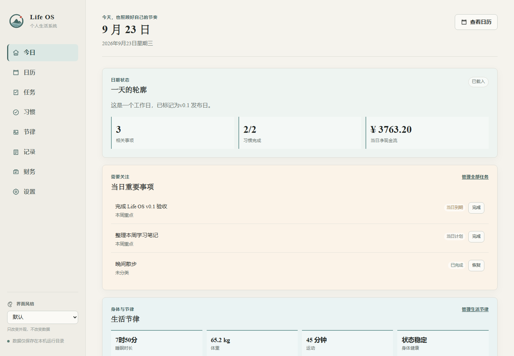
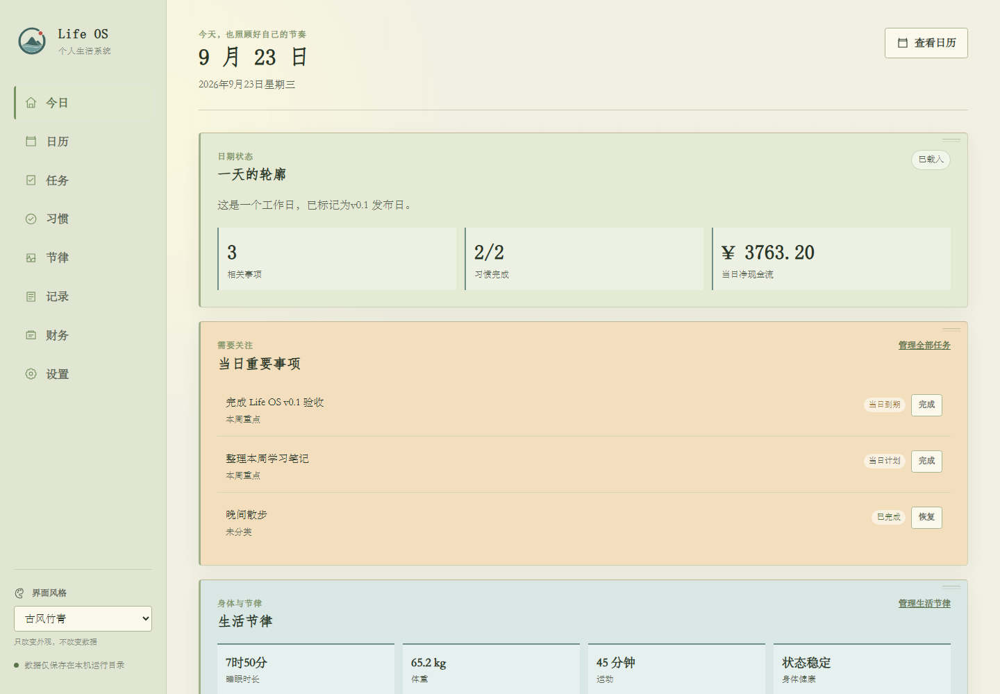
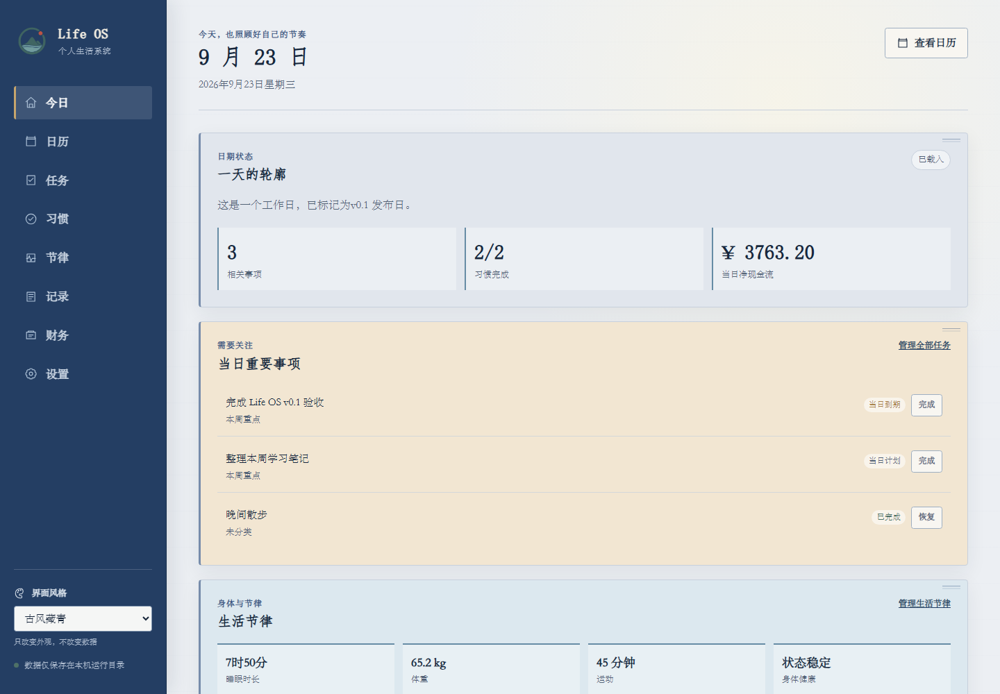
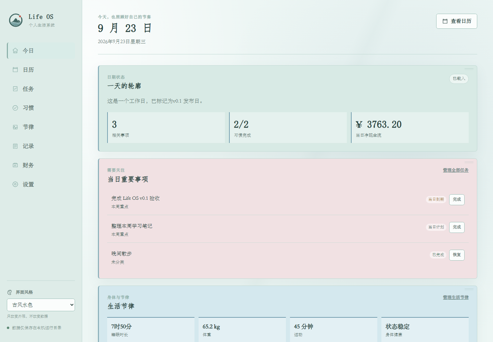
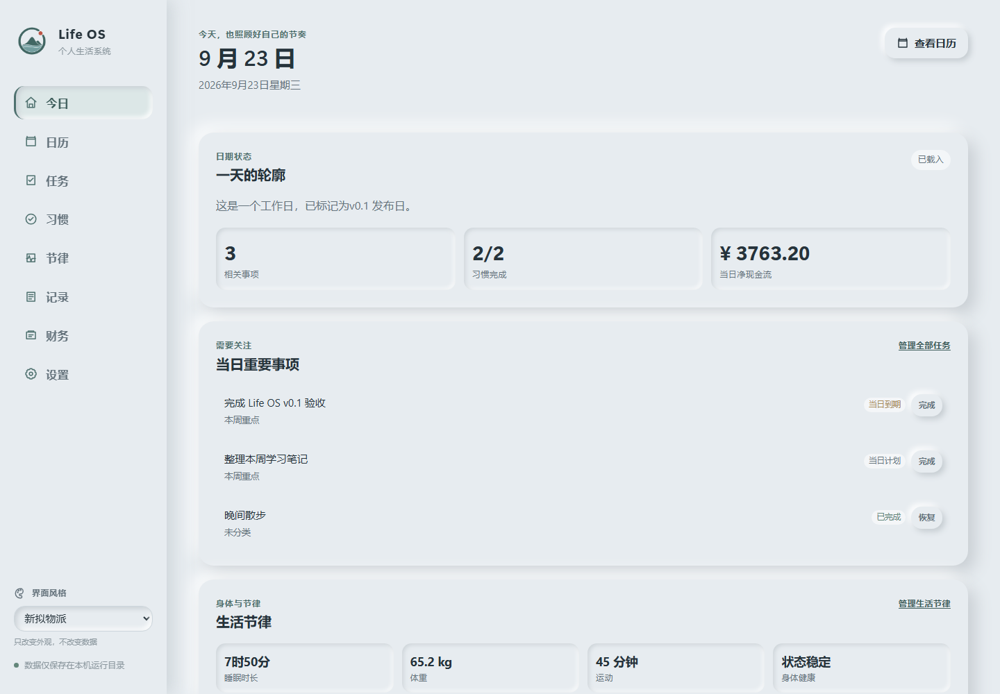
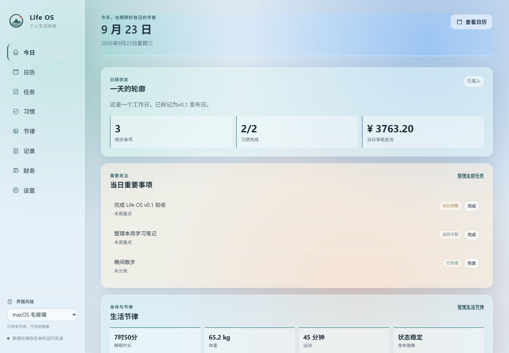
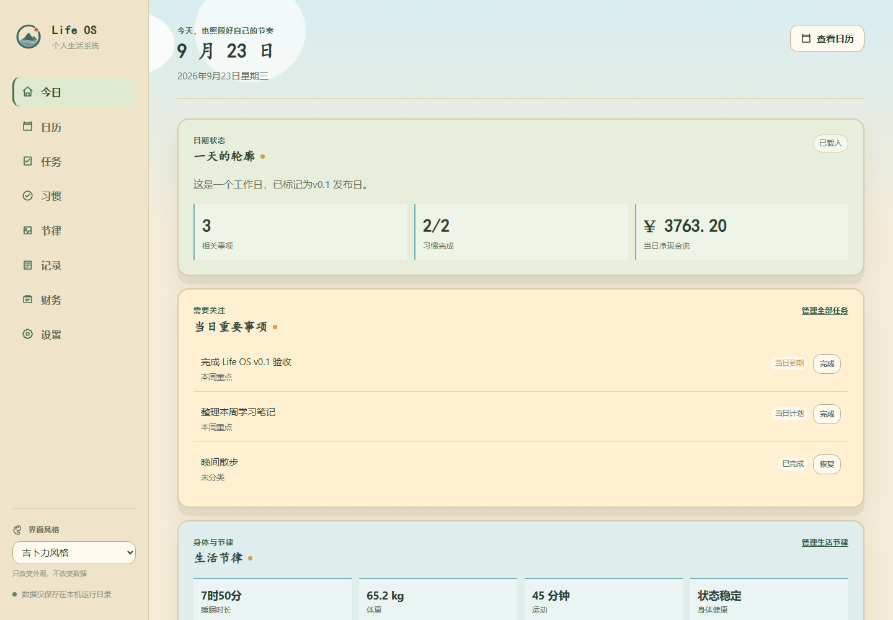

<p align="center">
  
</p>

<p align="center">
  <strong>本地优先、以日期为中心的个人生活管理桌面应用</strong><br>
  任务、习惯、日历、生活节律、Markdown 日记和个人财务，都保存在你自己的电脑中。
</p>

<p align="center">
  <code>v0.1.0</code> · Windows 10/11 · SQLite · Flask · pywebview · PyInstaller
</p>



## 功能概览

Life OS 以“某一天”为核心组织个人生活信息。“今日”提供当天总览；“日历”可以访问过去、现在和未来的任意日期，并以相同结构回顾历史或提前规划。

- 日期与日历：月历、离线农历、法定节假日与调休、自定义工作日/休息日及日期标记。
- 任务管理：创建、编辑、分类、优先级、计划/到期日期、状态流转、归档与恢复。
- 习惯管理：自定义习惯、单选分类、历史打卡、数值记录、停用与恢复。
- 生活节律：睡眠起止与时长、体重、运动、精力、情绪、身体状态和备注。
- Markdown 日记：自动保存、三级标题、当前时间插入、图片附件、安全预览和独立导出。
- 个人财务：账户、收入、支出、转账、分类、流水归档、资产负债和期间收支统计。
- 数据保护：每日/手动 SQLite 一致性备份、保留策略、CSV/Markdown/ZIP 全量导出及安全恢复。
- 便携运行：数据库、附件、缓存、配置、日志和备份统一位于一个 `life-os-data/` 目录。

## 七套界面风格

主题切换只改变前端配色、字体、边框、圆角、阴影与图标表现，不修改 SQLite 数据。

| 默认 | 古风竹青 |
| --- | --- |
|  |  |

| 古风藏青 | 古风水色 |
| --- | --- |
|  |  |

| 新拟物派 | macOS 毛玻璃 |
| --- | --- |
|  |  |

| 吉卜力风格 |
| --- |
|  |

## Windows 便携版

从 GitHub Releases 下载 `LifeOS-v0.1.0-windows-x64.zip`，解压后保持目录结构不变，双击 `LifeOS/LifeOS.exe` 即可。普通使用不需要安装 Python、Node.js、SQLite 服务或外部浏览器。

目标环境：

- 64 位 Windows 10 或 Windows 11。
- Microsoft Edge WebView2 Runtime；大多数现代 Windows 设备已预装。
- 对程序目录或自定义数据目录具有普通读写权限。
- 数据目录应位于本地 NTFS 磁盘，不建议直接放入实时云同步目录或网络共享盘。

首次运行会在 `LifeOS.exe` 旁创建 `life-os-data/`。也可以指定其他绝对路径：

```bat
LifeOS.exe --home "D:\LifeOSData"
```

完整的安装、迁移、备份和恢复步骤见[部署与迁移指南](部署与迁移指南.md)。

## 数据完全在本机

```text
life-os-data/
├── config/settings.json
├── database/life.db
├── backups/
│   └── restore-safety/
├── exports/
├── attachments/
├── cache/webview/
├── logs/app.log
├── temp/
└── metadata.json
```

关闭 Life OS 后复制整个 `life-os-data/`，即可迁移到另一台设备或不同绝对路径。应用默认只监听 `127.0.0.1`，不提供互联网或局域网服务，也不依赖云端账户。

## 从源码运行

源码开发需要 64 位 Python 3.12 或更高版本。Windows 下可直接运行：

```bat
start.bat
```

首次执行会创建项目内 `.venv` 并安装依赖。诊断命令：

```bat
.venv\Scripts\python.exe app.py --check
.venv\Scripts\python.exe app.py --no-browser
.venv\Scripts\python.exe app.py --home "D:\LifeOSData"
```

## 测试与构建

```bat
.venv\Scripts\python.exe -m pip install -r requirements-dev.txt
.venv\Scripts\python.exe -m pytest
build_desktop.bat
.venv\Scripts\python.exe scripts\package_release.py --version 0.1.0
```

最后两条命令分别生成 `dist/LifeOS/` 便携目录，以及带 SHA-256 校验文件的 `release/LifeOS-v0.1.0-windows-x64.zip`。GitHub Actions 会在 Windows + Python 3.12 环境执行完整测试套件。

## 技术结构

- 后端：Python、Flask、Flask-SQLAlchemy、SQLite。
- 前端：Jinja、原生 JavaScript ES Modules、HTML/CSS，无 Node.js 构建链。
- 桌面宿主：Waitress 随机回环端口、pywebview、Edge WebView2。
- 发行：PyInstaller `onedir`，应用版本与 Windows 文件版本统一为 `0.1.0`。
- 数据模型：schema v4，可从 schema v1–v3 原地升级。

核心接口统一使用 `{"success": true, "data": ...}` 或 `{"success": false, "error": ...}`。接口字段与验收行为见[接口验收清单](接口验收清单.md)，数据库结构见[数据库模型](数据库模型.md)。

## v0.1 边界

当前版本不包含云同步、账户体系、手机 App、消息提醒、财务预算/账单导入、多币种、投资分析、复杂富文本、CSV 回导或 AI 分析。日历内置 2025、2026 年正式公布的法定节假日安排；未正式公布的年份不会猜测。

应用内备份不能替代异地备份或设备加密。重要数据应定期复制到独立介质，并验证 ZIP 导出或 SQLite 备份能够打开。

## 文档

- [部署与迁移指南](部署与迁移指南.md)
- [工程需求提纲](个人生活管理系统%20Life%20OS%20v0.1%20工程需求提纲.md)
- [里程碑计划](里程碑计划.md)
- [数据库模型](数据库模型.md)
- [接口验收清单](接口验收清单.md)
- [界面主题设计规范](界面主题设计规范.md)
- [M8 系统验收与 v0.1 发布记录](M8系统验收与v0.1发布记录.md)

## 许可说明

当前仓库尚未附加开源许可证，默认保留所有权利。若计划开放协作或二次分发，应先明确并补充许可证。
