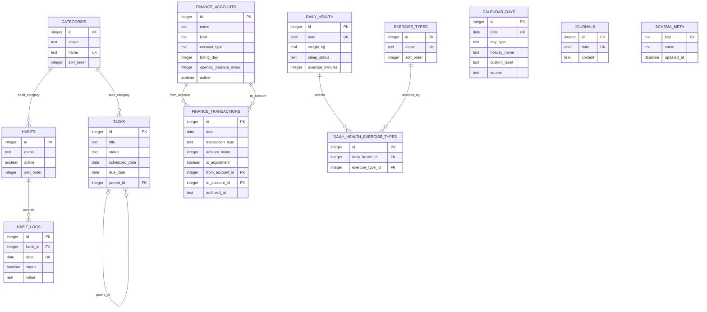

# Life OS v0.1 数据库模型

## 模型边界

SQLite 数据库是结构化业务数据的权威副本，保存于 `LIFE_OS_HOME/database/life.db`。配置、日志、备份、导出、附件和缓存属于同一运行时根目录，但不因此写入业务表。日记正文仅保存图片的受控相对 URL，图片文件位于 `LIFE_OS_HOME/attachments/journal/`；v0.1 不建立用户、权限、AI、统计快照或文件附件表。

界面主题是可丢弃的表现层偏好，不属于领域数据。v0.1 不新增 `themes`、`user_preferences` 或类似数据库表；选择值仅存于桌面 WebView 的 `LIFE_OS_HOME/cache/webview/`。清空主题偏好不得影响任何任务、习惯、健康、日记、日历或财务记录。

M5 任务与习惯闭环使用 `tasks`、`habits` 和 `habit_logs`；2026-09-21 的分类增量在 schema v3 新增 `categories`，M6 后续把 schema 升到 v4并扩展 `finance` 作用域，使任务、习惯和财务均可使用独立的可创建单选分类。信用卡账期增量把 schema 升到 v5，在 `finance_accounts` 增加可迁移的账单日字段；余额调整增量把 schema 升到 v6，以 `finance_transactions.is_adjustment` 区分校准流水；生活节律调整把 schema 升到 v7，增加 `sleep_status`、运动种类与每日多选关联。任务恢复只清空 `tasks.archived_at`；习惯停用与恢复只切换 `habits.active`；每日完成切换按 `(habit_id, date)` upsert，并保留既有数值、单位和备注。界面排序只更新现有 `sort_order`，不建立额外排序表。

系统以日期为逻辑关联维度，但不为每一天预建空记录。`calendar_days` 只保存用户显式设置或未来导入的日期分类与标记；国务院已公布的节假日安排作为版本化只读程序数据进入服务层，不批量写入用户数据库，农历也由前端本地派生。没有用户记录或官方预置的日期才按星期推断。`habit_logs`、`tasks`、`daily_health`、`journals`、`finance_transactions` 和解析后的日期属性通过 ISO 生活日期在服务层与 `/api/day/{date}` 聚合。

周/月/年习惯与生活节律报表直接聚合现有 `habit_logs`、`daily_health` 和每日运动种类关联，不新增统计快照或缓存表。日记月历只按 `journals.date` 的现有唯一索引读取月份内的日期与更新时间。习惯 `icon`、旧版精确睡眠列与财务流水 `note` 继续留在 schema 和全量导出中作为兼容字段，但当前前端不再采集；任何省略字段的更新都必须保留旧值。

## 实体关系

`date UK` 在 `habit_logs` 中表示与 `habit_id` 组成联合唯一键，而不是单独唯一。`categories` 与任务、习惯、财务流水之间是由 `scope + name` 约束的逻辑关系。为兼容 schema v1–v3 已有文本数据，三个业务表的分类字段暂不改为外键；任务和习惯服务只允许写入相应作用域中已存在的规范名称，财务 API 保留旧自由文本兼容读取，而 M6 页面新写入使用 `finance` 单选项。

## 通用存储约定

- 主键使用 SQLite `INTEGER PRIMARY KEY`，由数据库生成。
- 生活日期在 SQLAlchemy 中使用 `Date`，SQLite 按 ISO `YYYY-MM-DD` 保存，由服务层做严格日历校验。
- 事件时间使用带本地 UTC 偏移的 ISO 8601 `TEXT`，例如 `2026-09-18T14:17:59+08:00`。
- 布尔值使用 `INTEGER`，仅允许 `0` 或 `1`。
- 重量和习惯数值使用 `REAL`；服务层负责单位和合理范围校验。
- 财务金额使用整数分存储，API 以两位小数字符串交换，不使用浮点金额。v0.1 汇总币种固定为 CNY。
- 所有用户可修改的业务表包含 `created_at` 与 `updated_at`；更新成功后才修改 `updated_at`。
- SQLite 连接必须执行 `PRAGMA foreign_keys = ON`，设置合理的 `busy_timeout`。如采用 WAL，备份和迁移流程必须同时考虑 WAL/SHM 文件并在正常关闭时完成必要 checkpoint。
- v0.1 不执行物理级联删除。被引用的习惯与父任务采用停用、归档或 `ON DELETE RESTRICT/SET NULL`。

## `schema_meta`

保存应用理解数据库所必需的少量结构元数据，不保存用户配置。

| 字段 | 类型 | 约束 | 说明 |
|---|---|---|---|
| `key` | TEXT | PK, NOT NULL | 元数据键，例如 `schema_version` |
| `value` | TEXT | NOT NULL | 元数据值 |
| `updated_at` | TEXT | NOT NULL | 最后更新时间 |

首次初始化至少写入 `schema_version`。应用遇到高于自身支持范围的版本时必须停止写入并明确报错。

## `calendar_days`

该表只保存显式日期覆盖。没有未归档记录时，周一至周五推断为 `workday`，周六和周日推断为 `rest_day`。

| 字段 | 类型 | 约束 | 说明 |
|---|---|---|---|
| `id` | INTEGER | PK | 日期记录标识 |
| `date` | DATE | NOT NULL, UNIQUE | 被标记的生活日期 |
| `day_type` | TEXT | NOT NULL, CHECK | `workday` 或 `rest_day` |
| `holiday_name` | TEXT | NULL | 节假日名称，例如“国庆节” |
| `custom_label` | TEXT | NULL | 用户自定义短标签，例如“年假”“调休上班” |
| `note` | TEXT | NULL | 补充说明 |
| `source` | TEXT | NOT NULL, CHECK | `manual` 或为未来导入预留的 `imported` |
| `archived_at` | TEXT | NULL | 清除显式标记时写入，恢复星期推断 |
| `created_at` | TEXT | NOT NULL | 创建时间 |
| `updated_at` | TEXT | NOT NULL | 更新时间 |

`day_type` 是工作/休息语义的唯一依据，`holiday_name` 和 `custom_label` 不隐式改变日期类型。数据库中的 `source` 仍只接受 `manual|imported`；API 解析结果可以额外返回只读的 `source=official`，但它不对应数据库行且 `explicit=false`。相同日期重复设置执行 upsert 并复用原记录；已归档记录再次设置时恢复该记录。索引 `(archived_at, date)` 支持有效覆盖查询，`date` 唯一约束防止同日多条冲突记录。

## `categories`

| 字段 | 类型 | 约束 | 说明 |
|---|---|---|---|
| `id` | INTEGER | PK | 分类标识 |
| `scope` | TEXT | NOT NULL, CHECK | `task`、`habit` 或 `finance` |
| `name` | TEXT | NOT NULL, NOCASE | 显示名称；同一作用域内不区分大小写唯一 |
| `sort_order` | INTEGER | NOT NULL, DEFAULT 0 | 选项排序 |
| `created_at` | TEXT | NOT NULL | 创建时间 |
| `updated_at` | TEXT | NOT NULL | 更新时间 |

唯一约束为 `(scope, name)`，索引 `(scope, sort_order, id)` 支持稳定列出。任务、习惯与财务可使用同名分类，但页面不跨作用域混用；空分类继续用 `NULL` 表示“未分类”。v0.1 开放创建、完整重排和删除未使用分类；删除前按作用域检查当前、停用及已归档业务记录，存在引用时返回数量与最多 20 条具体引用而不级联清空。财务服务保留已有自由文本分类的 API 兼容性，M6 页面新建流水使用 `finance` 作用域单选项。

## `habits`

| 字段 | 类型 | 约束 | 说明 |
|---|---|---|---|
| `id` | INTEGER | PK | 习惯标识 |
| `name` | TEXT | NOT NULL | 显示名称，去除首尾空白后不能为空 |
| `description` | TEXT | NULL | 说明 |
| `icon` | TEXT | NULL | 图标名或短文本，不保存外部绝对路径 |
| `category` | TEXT | NULL | 可选分类；必须匹配 `categories.scope=habit` 的现有名称 |
| `active` | INTEGER | NOT NULL, DEFAULT 1, CHECK 0/1 | 是否出现在默认记录列表 |
| `sort_order` | INTEGER | NOT NULL, DEFAULT 0 | 同级排序 |
| `created_at` | TEXT | NOT NULL | 创建时间 |
| `updated_at` | TEXT | NOT NULL | 更新时间 |

索引：`(active, sort_order, id)`。停用习惯不得删除历史日志；重新启用后继续使用原 `id`。

## `habit_logs`

| 字段 | 类型 | 约束 | 说明 |
|---|---|---|---|
| `id` | INTEGER | PK | 日志标识 |
| `habit_id` | INTEGER | NOT NULL, FK → `habits.id`, ON DELETE RESTRICT | 对应习惯 |
| `date` | TEXT | NOT NULL | 生活日期 |
| `status` | INTEGER | NOT NULL, DEFAULT 0, CHECK 0/1 | 完成状态 |
| `value` | REAL | NULL | 分钟、次数、距离等可选数值 |
| `value_unit` | TEXT | NULL | `value` 的单位；v0.1 UI 可暂不编辑 |
| `note` | TEXT | NULL | 当日补充说明 |
| `created_at` | TEXT | NOT NULL | 创建时间 |
| `updated_at` | TEXT | NOT NULL | 更新时间 |

约束与索引：

- `UNIQUE(habit_id, date)`，保证一个习惯每天最多一条记录。
- `INDEX(date)`，支持日期聚合。
- `INDEX(habit_id, date)` 可由唯一索引覆盖，不重复创建等价索引。

## `tasks`

| 字段 | 类型 | 约束 | 说明 |
|---|---|---|---|
| `id` | INTEGER | PK | 任务标识 |
| `title` | TEXT | NOT NULL | 标题，去除首尾空白后不能为空 |
| `description` | TEXT | NULL | 详细说明 |
| `status` | TEXT | NOT NULL, DEFAULT `todo` | `todo`、`doing`、`done`、`cancelled` |
| `priority` | TEXT | NOT NULL, DEFAULT `normal` | `low`、`normal`、`high`、`urgent` |
| `category` | TEXT | NULL | 可选分类；必须匹配 `categories.scope=task` 的现有名称 |
| `scheduled_date` | TEXT | NULL | 计划处理日期 |
| `due_date` | TEXT | NULL | 到期日期 |
| `completed_at` | TEXT | NULL | 完成时间；仅 `done` 状态使用 |
| `sort_order` | INTEGER | NOT NULL, DEFAULT 0 | 同组排序 |
| `parent_id` | INTEGER | NULL, FK → `tasks.id`, ON DELETE SET NULL | 子任务预留字段 |
| `archived_at` | TEXT | NULL | 归档/软删除时间 |
| `created_at` | TEXT | NOT NULL | 创建时间 |
| `updated_at` | TEXT | NOT NULL | 更新时间 |

检查约束：`status` 和 `priority` 只能取上述枚举值；`parent_id` 不能等于自身 `id`。服务层还需阻止父子循环。状态改为 `done` 时自动设置 `completed_at`；离开 `done` 时清空它，除非未来版本明确保留完成历史。

索引：

- `(scheduled_date, status, archived_at)`：当天计划任务。
- `(due_date, status, archived_at)`：到期和逾期任务。
- `(status, archived_at)`：状态列表。
- `(parent_id)`：未来子任务查询。

## `daily_health`

| 字段 | 类型 | 约束 | 说明 |
|---|---|---|---|
| `id` | INTEGER | PK | 记录标识 |
| `date` | TEXT | NOT NULL, UNIQUE | 生活日期 |
| `weight_kg` | REAL | NULL, CHECK > 0 | 体重，单位 kg |
| `sleep_start` | TEXT | NULL | 兼容列；旧版带日期与偏移的入睡时间 |
| `sleep_end` | TEXT | NULL | 兼容列；旧版推导结束时间 |
| `sleep_duration_minutes` | INTEGER | NULL, CHECK 0–1440 | 兼容列；旧版精确睡眠分钟数 |
| `sleep_duration_manual` | INTEGER | NOT NULL, DEFAULT 0, CHECK 0/1 | 兼容列；旧版是否直接记录睡眠时长 |
| `sleep_quality` | INTEGER | NULL, CHECK 1–5 | 兼容列；旧版睡眠质量 |
| `sleep_status` | TEXT | NULL, CHECK 枚举 | 当前睡眠情况区间：`under_4_5`、`between_4_5_6`、`between_6_7_5`、`over_7_5` 或 `over_9` |
| `energy_level` | INTEGER | NULL, CHECK 1–5 | 精力 |
| `mood_level` | INTEGER | NULL, CHECK 1–5 | 情绪 |
| `body_status` | TEXT | NULL | 身体状态短文本 |
| `exercise_minutes` | INTEGER | NULL, CHECK ≥ 0 | 当日运动时长 |
| `note` | TEXT | NULL | 健康备注 |
| `created_at` | TEXT | NOT NULL | 创建时间 |
| `updated_at` | TEXT | NOT NULL | 更新时间 |

当前健康接口只写入 `sleep_status`、体重、精力、情绪、身体状态、运动分钟、运动种类和备注。`sleep_start`、`sleep_end`、`sleep_duration_minutes`、`sleep_duration_manual` 与 `sleep_quality` 为旧版精确睡眠记录兼容列：升级不删除、不改写，仍进入全量导出，但不再由前端或 HTTP 健康接口更新。部分当前字段为空时仍允许保存。`date` 的唯一约束同时提供日期查询索引。

生活节律统计只使用新的睡眠情况区间，不再把旧精确时长混入当前报表。睡眠区间是用户主动选择的状态标签，不从兼容列自动推断，避免升级时擅自解释旧记录。

## `exercise_types` 与 `daily_health_exercise_types`

`exercise_types` 保存用户可管理的运动种类，名称大小写不敏感且唯一，`sort_order` 控制多选块和管理列表顺序。`daily_health_exercise_types` 使用外键关联某日健康记录与运动种类，并以 `(daily_health_id, exercise_type_id)` 唯一约束避免重复选择。删除仍被历史记录使用的运动种类返回冲突；健康记录删除时关联行级联删除。两个表均进入开放格式导出。

## `journals`

| 字段 | 类型 | 约束 | 说明 |
|---|---|---|---|
| `id` | INTEGER | PK | 日记标识 |
| `date` | TEXT | NOT NULL, UNIQUE | 一天一篇 |
| `content` | TEXT | NOT NULL, DEFAULT `''` | Markdown 原文 |
| `created_at` | TEXT | NOT NULL | 创建时间 |
| `updated_at` | TEXT | NOT NULL | 更新时间 |

空内容是否保留由服务层统一决定：建议空字符串仍可保存，以使自动保存语义简单；导出时可跳过空日记。`date` 的唯一约束同时提供日期查询索引。

日记的可写日期不是数据库约束，而是领域/API 规则：仅设备本地今天可以执行正文 upsert 或新增附件；历史与未来记录只读。月份索引使用 `date BETWEEN 月初 AND 月末`，只返回日期和更新时间，不加载全部正文。

## `finance_accounts`

| 字段 | 类型 | 约束 | 说明 |
|---|---|---|---|
| `id` | INTEGER | PK | 财务账户标识 |
| `name` | TEXT | NOT NULL | 账户名称 |
| `kind` | TEXT | NOT NULL, CHECK | `asset` 或 `liability` |
| `account_type` | TEXT | NOT NULL, CHECK | `cash`、`bank`、`credit`、`investment` 或 `other` |
| `billing_day` | INTEGER | NULL, CHECK 1–28 | 信用卡每月账单日；其他账户为空 |
| `currency` | TEXT | NOT NULL, CHECK | v0.1 固定为 `CNY` |
| `opening_balance_minor` | INTEGER | NOT NULL | 期初余额，单位分；负债使用零或负数 |
| `active` | INTEGER | NOT NULL, CHECK 0/1 | 是否允许新流水使用 |
| `sort_order` | INTEGER | NOT NULL | 展示排序 |
| `created_at` | TEXT | NOT NULL | 创建时间 |
| `updated_at` | TEXT | NOT NULL | 更新时间 |

账户当前余额由期初余额与未归档流水动态计算，不单独保存可与流水分离的缓存余额。用户输入目标余额时，服务端在同一事务中计算当前余额与差额，并自动写入系统当天的调整流水；不直接覆写期初余额或保存第二份当前余额。资产账户期初余额不得为负，负债账户用负数表示待偿还余额。`credit` 必须使用负债性质；新建信用卡未提供 `billing_day` 时使用 18，旧信用账户迁移到 schema v5 时同样补为 18。账期、上期账单、已还金额和待还金额均由账单日与流水实时派生，不保存可能与流水失去一致性的账单缓存。

## `finance_transactions`

| 字段 | 类型 | 约束 | 说明 |
|---|---|---|---|
| `id` | INTEGER | PK | 流水标识 |
| `date` | DATE | NOT NULL | 生活日期 |
| `transaction_type` | TEXT | NOT NULL, CHECK | `income`、`expense` 或 `transfer` |
| `amount_minor` | INTEGER | NOT NULL, CHECK > 0 | 正数金额，单位分 |
| `is_adjustment` | INTEGER | NOT NULL, CHECK 0/1 | 是否为系统生成的账户余额调整流水 |
| `from_account_id` | INTEGER | NULL, FK | 支出/转出账户 |
| `to_account_id` | INTEGER | NULL, FK | 收入/转入账户 |
| `category` | TEXT | NULL | 用户分类；M6 页面使用 `categories.scope=finance` 单选项 |
| `description` | TEXT | NULL | 摘要或对方 |
| `note` | TEXT | NULL | 旧版补充备注；当前界面不再采集，兼容读取与导出保留 |
| `archived_at` | TEXT | NULL | 软删除时间 |
| `created_at` | TEXT | NOT NULL | 创建时间 |
| `updated_at` | TEXT | NOT NULL | 更新时间 |

收入只允许 `to_account_id`，支出只允许 `from_account_id`，转账必须同时指定两个不同账户。转账同时减少转出账户、增加转入账户，不计入收入或支出统计。索引覆盖日期、类型、转出账户、转入账户和归档状态。

总体财务摘要使用 SQLite 条件聚合计算期间收入/支出，并按转出、转入账户分组汇总余额变化，不加载全量流水实体；金额仍只使用整数分。期间财务报表复用账户期初余额，以区间前按账户聚合的转出/转入作为日期基线，再读取区间内必要流水列逐日推进余额，因此不新增统计表、缓存表或冗余资产快照；分类汇总排除转账与余额调整，资产序列仍包含它们的余额影响。编辑旧流水时前端省略 `note`，服务层的 `UNSET` 语义确保历史备注不被写成空值。

## 数据操作规则

- 习惯日志、每日健康和日记使用按唯一键 upsert；重复请求不得新增第二条记录。
- 日期显式分类按 `date` upsert；清除操作写入 `archived_at`，解析结果优先恢复官方预置，不存在预置时恢复星期推断。
- 任务归档设置 `archived_at`，默认查询排除已归档任务；v0.1 不提供永久删除 API。
- 财务流水归档设置 `archived_at`，归档后不再影响当日或总体汇总；账户停用不删除历史流水。
- 余额调整流水使用收入或支出的账户方向表达正负差额，但 `is_adjustment=1`，因此影响账户余额、总资产、总负债与净资产，不进入收入、支出或净现金流；系统生成后不可直接编辑，可通过归档撤销并重新调整。
- 信用卡消费使用 `expense + from_account_id=信用卡`；还款使用 `transfer + to_account_id=信用卡`。账单日次日开始新账期，历史日期查询只统计不晚于该日期的未归档流水。
- 停用习惯只更新 `active`，不得修改或删除历史日志。
- 所有聚合读取在一致的事务/连接上下文中完成，防止同一响应混合不同提交时刻的数据。
- API 不允许客户端直接写入 `id`、`created_at` 或 schema 元数据。

## 初始化与演进

首次启动创建表、索引并写入 `schema_version = 7`，随后执行 `PRAGMA integrity_check`。已有 schema v1 先补齐财务表，schema v1/v2 再新增 `categories`；schema v3 会安全重建分类约束以加入 `finance` 作用域；schema v4 为财务账户增加 `billing_day`，并为已有 `credit` 账户补入默认值 18；schema v5 为财务流水增加 `is_adjustment`，既有记录统一取 0；schema v6 为 `daily_health` 增加可空的 `sleep_status`，并由 ORM 建立运动种类及其每日关联表。所有迁移均不改写旧精确睡眠、金额、账户方向或归档状态。分类迁移会把既有非空名称按作用域回填为分类选项，不修改或删除原业务记录。已有业务表但缺少 `schema_meta`，或 schema 版本高于程序支持范围时，程序停止写入。每个 SQLite 连接启用 `foreign_keys = ON`、`busy_timeout = 5000`、WAL 和 `synchronous = NORMAL`；正常关闭时执行 WAL checkpoint。后续非纯新增表的结构变更应引入完整的版本化迁移工具。
